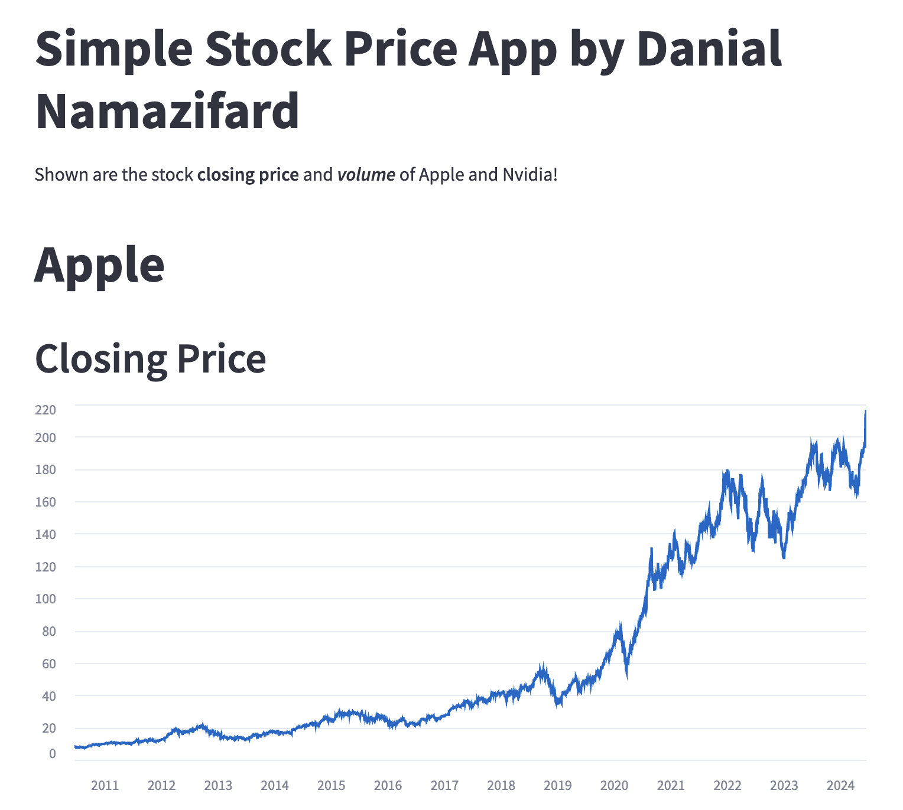

# Stock_Price_NVDA_AAPL
## Simple Stock Price of Nvidia (NVDA) and Apple (AAPL) Companies since 2010!

This Streamlit-based web application fetches and displays historical stock prices and volume data for Apple Inc. (AAPL) and NVIDIA Corporation (NVDA).

## Overview

This application utilizes the Yahoo Finance API (yfinance) to retrieve daily historical stock data, specifically:
- **Closing Prices**: Visualizes the closing price trends over time.
- **Volume**: Shows the trading volume trends over time.

## Features

- **Interactive Visualization**: Charts are interactive and responsive, allowing users to zoom in and out for detailed analysis.
- **Multiple Stock Data**: Displays data for both Apple and NVIDIA, enabling comparison of stock performance.
- **Dynamic Data Retrieval**: Data is dynamically fetched based on the specified date range.
l -r requirements.txt

### Usage

1. Run the Streamlit app:
   ```bash
   streamlit run app.py
   ```

2. Open a browser and navigate to `http://localhost:8501` to view the application.

### Example Screenshots


